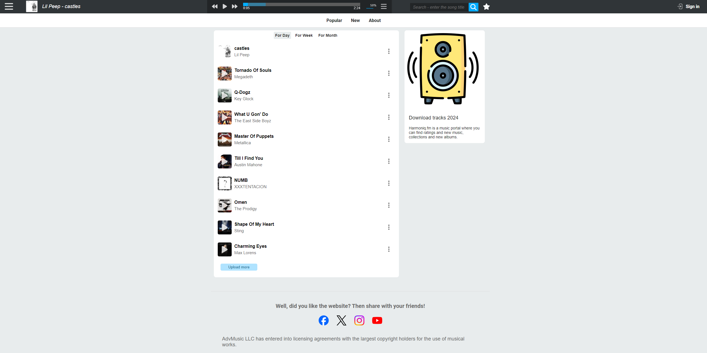

# Platform for Streaming and Listening to Music

This music listening application offers users the ability to stream audio tracks, 
create playlists, and enjoy a personalized music experience. The platform allows users 
to search for and play tracks, save music to favorites and download.


## Technology Stack




Application Overview - [Watch on YouTube](https://youtu.be/cgaqNQ8OKtI)


# Application Architecture

The application follows a client-server architecture. The frontend, built using React, sends HTTP requests to a Node.js server that processes requests using Express. User authentication is implemented with JWT, allowing secure access to protected resources.

## Key Features

- **User Registration and Authentication** — Users can create accounts and log in using their credentials.

- **Track Uploading** — Authenticated users can upload and add new tracks to the library available for listening.

- **Playlist Creation and Management** — Users can create their own playlists, add and remove tracks.

- **Adding Songs to Playlists** — Users can easily add songs to their playlists for a personalized experience. The playlist can be dynamically updated, offering flexibility in organizing their music library.

- **Real-Time Updates** — The interface is updated without needing toЗапуск проекта reload the page, thanks to React’s dynamic functionality and interaction with the server via REST API.


## Installation
* Clone project to your computer from Github using the command:
```
git clone https://github.com/OleksiiArtemenko/music-web.git
```

* Open the Frontend folder, install dependencies and build the project using commands:
```
cd frontend
```
```
npm install
```
```
npm run build
```
* Open the Backend folder and install dependencies using the command:
```
cd ..
```
```
cd backend
```
```
npm install
```
* Start the project using the command:
```
node server.js
```
